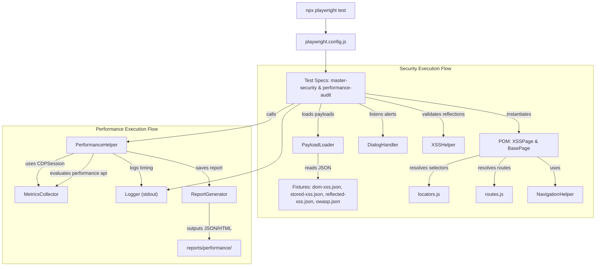

# 🛡️ Enterprise Automated Security & Performance Testing Framework

This repository hosts a production-grade, extensible automated Security and Performance testing framework built on top of [Playwright](https://playwright.dev/). The framework is designed to actively audit web applications (specifically targeting vulnerable environments like OWASP Juice Shop) for severe security vulnerabilities—including DOM, Reflected, and Stored Cross-Site Scripting (XSS), OWASP Top 10 vulnerabilities, and insecure cookie policies—while simultaneously auditing front-end performance metrics using Chrome DevTools Protocol (CDP).

---

## 🏗️ Architecture Overview

The framework employs a highly modular, decoupled architecture following industry-standard design patterns to ensure maximum test stability, maintainability, and clean separation of concerns.

### High-Level Architecture Design


### Design Patterns Used
*   **Page Object Model (POM):** UI operations are abstracted away from spec assertions. The [BasePage](file:///c:/Users/satish.patil1/Sp-learning/security-testing-playwright-juiceshop-main/playwright-tests/pages/base.page.js) class encapsulates page-level interactions, while the [XSSPage](file:///c:/Users/satish.patil1/Sp-learning/security-testing-playwright-juiceshop-main/playwright-tests/pages/xss.page.js) handles input injections, chatbot prompts, forms submissions, and login actions.
*   **Static Resource Locator Pattern:** All element selectors are extracted into a centralized, read-only dictionary within [locators.js](file:///c:/Users/satish.patil1/Sp-learning/security-testing-playwright-juiceshop-main/playwright-tests/constants/locators.js), completely separating locators from interaction code.
*   **Factory / Loader Pattern:** Data files (JSON-formatted vulnerability payloads) are parsed dynamically at runtime using the [PayloadLoader](file:///c:/Users/satish.patil1/Sp-learning/security-testing-playwright-juiceshop-main/playwright-tests/utils/payload-loader.js) utility.
*   **CDP Session Pattern (Chrome DevTools Protocol):** The [MetricsCollector](file:///c:/Users/satish.patil1/Sp-learning/security-testing-playwright-juiceshop-main/playwright-tests/utils/metrics-collector.js) initializes a raw CDP session (`page.context().newCDPSession(page)`) to capture runtime heap size, DOM node count, and rendering durations directly from the V8 browser engine.

### Scalability Approach
*   **Decoupled Payloads:** Security engineers can append or modify security payloads in [dom-xss.json](file:///c:/Users/satish.patil1/Sp-learning/security-testing-playwright-juiceshop-main/playwright-tests/fixtures/payloads/dom-xss.json) or [reflected-xss.json](file:///c:/Users/satish.patil1/Sp-learning/security-testing-playwright-juiceshop-main/playwright-tests/fixtures/payloads/reflected-xss.json) without changing a single line of JavaScript.
*   **Abstracted Verification:** Assertions checking whether payload injections succeeded are routed through [XSSHelper](file:///c:/Users/satish.patil1/Sp-learning/security-testing-playwright-juiceshop-main/playwright-tests/helpers/xss.helper.js). If sanitization logic in the target app changes, only the helper needs modification.
*   **Multi-Browser & Multi-Target Readiness:** Environment-specific configurations are handled globally via standard environment variables and config files, permitting execution against Local, Staging, or Cloud-hosted builds.

---

## 🔄 Project Flow

The framework execution occurs in a highly structured lifecycle to prevent flaky runs and handle asynchronous browser interruptions (such as welcome modals or javascript alert boxes).

### Step-by-Step Execution Flow
1.  **Test Run Triggered:** The user executes the test suite. Playwright runs the config initializer from [playwright.config.js](file:///c:/Users/satish.patil1/Sp-learning/security-testing-playwright-juiceshop-main/playwright-tests/playwright.config.js).
2.  **Vulnerability Data Ingestion:** Within `beforeAll()` in [master-security.spec.js](file:///c:/Users/satish.patil1/Sp-learning/security-testing-playwright-juiceshop-main/playwright-tests/tests/security/master-security.spec.js), the [PayloadLoader](file:///c:/Users/satish.patil1/Sp-learning/security-testing-playwright-juiceshop-main/playwright-tests/utils/payload-loader.js) reads the active JSON payload fixtures.
3.  **Vulnerability Handler Setup:** Before loading the site, [DialogHandler](file:///c:/Users/satish.patil1/Sp-learning/security-testing-playwright-juiceshop-main/playwright-tests/utils/dialog-handler.js) hooks onto the active Playwright page `dialog` event. Any XSS alert boxes triggered by payloads are intercepted, logged as successful breaches, and dismissed immediately to keep the test runner from hanging.
4.  **Target Navigation & Modal Handling:** The POM navigates to the target page via [NavigationHelper](file:///c:/Users/satish.patil1/Sp-learning/security-testing-playwright-juiceshop-main/playwright-tests/helpers/navigation.helper.js). If the "Welcome / Dismiss" popup is present (common in Juice Shop), it is dismissed automatically.
5.  **Payload Injection Loop:** The spec loops through each payload, injecting it into target components (inputs, hash fragments, headers, local storage) using [XSSPage](file:///c:/Users/satish.patil1/Sp-learning/security-testing-playwright-juiceshop-main/playwright-tests/pages/xss.page.js).
6.  **Reflection Check:** [XSSHelper](file:///c:/Users/satish.patil1/Sp-learning/security-testing-playwright-juiceshop-main/playwright-tests/helpers/xss.helper.js) analyzes the current page content and DOM structure. If the injected script string is found in the DOM unescaped, it logs a reflection success/failure.
7.  **Structured Log Output:** Throughout runtime, [Logger](file:///c:/Users/satish.patil1/Sp-learning/security-testing-playwright-juiceshop-main/playwright-tests/utils/logger.js) outputs formatted console statements with ANSI escape color codes, indicating `[INFO]`, `[SUCCESS]`, `[WARN]`, or `[ERROR]`.
8.  **Performance Auditing Output:** If running performance checks, [PerformanceHelper](file:///c:/Users/satish.patil1/Sp-learning/security-testing-playwright-juiceshop-main/playwright-tests/helpers/performance.helper.js) calls [ReportGenerator](file:///c:/Users/satish.patil1/Sp-learning/security-testing-playwright-juiceshop-main/playwright-tests/utils/report-generator.js) which outputs structured JSON and static HTML tables summarizing load and paint metrics into the `reports/performance/` directory.

---

## 🚀 Quick Start

### 📋 Prerequisites
Ensure the following are installed locally:
*   [Node.js](https://nodejs.org/) (LTS version 18+ or 20+ recommended)
*   Git (for cloning vulnerable applications)

---

### 📦 Step 1: Set up the Target Application (OWASP Juice Shop)
The security test suites expect a local instance of OWASP Juice Shop running on port `3000`.

> [!WARNING]
> Do not run security tests against public websites unless you have explicit permission.

```bash
# Clone the repository (run this in a separate directory outside playwright-tests)
git clone https://github.com/juice-shop/juice-shop.git
cd juice-shop

# Install dependencies
npm install

# Start the vulnerable application
npm start
```
*Verify Juice Shop is active by navigating to `http://localhost:3000` in your browser.*

---

### 🛠️ Step 2: Install the Playwright Security Framework
In a separate terminal window, navigate to the `playwright-tests` directory.

```bash
# Navigate to the testing project folder
cd playwright-tests

# Install package dependencies
npm install

# Install Playwright browser engines (Chromium is utilized by default)
npx playwright install chromium
```

---

### 🏃 Step 3: Execution Commands

Run the test suites using the following NPM or Playwright CLI commands:

```bash
# Run ALL security and performance tests
npx playwright test

# Run ONLY security tests
npx playwright test tests/security/

# Run ONLY performance tests
npx playwright test tests/performance/

# Run a specific security test (e.g. DOM XSS)
npx playwright test -g "DOM XSS"

# Run tests in headed browser mode (visible UI)
npx playwright test --headed
```

---

### 📊 Step 4: Access Reports

```bash
# Show default Playwright HTML test report
npx playwright show-report
```

For performance test runs, access the custom JSON and HTML metrics reports in the following folder:
`playwright-tests/reports/performance/` (e.g., [reports/performance/](file:///c:/Users/satish.patil1/Sp-learning/security-testing-playwright-juiceshop-main/playwright-tests/reports/performance/)).

---

## ⚙️ Environment Configuration

The framework supports external environment configuration to decouple endpoints, parameters, and credentials from core tests.

### `.env` File Integration
Create a file named `.env` in the root of the `playwright-tests` directory (e.g. `playwright-tests/.env`).
To load it, ensure `dotenv` is installed (`npm install dotenv --save-dev`) and imported in the playwright configuration.

### Sample Environment Variables (`playwright-tests/.env`)
```env
# Target URLs
TARGET_URL=http://localhost:3000
PERF_AUDIT_URLS=https://www.google.com,https://www.amazon.in,https://www.wikipedia.org

# Authentication Secrets
TEST_USER_EMAIL=jim@juice-sh.op
TEST_USER_PASSWORD=ncc-1701

# Framework Control
CI=false
MAX_WORKERS=1
TEST_TIMEOUT=60000
```

### Secrets and Configurations Handling
*   **Security Credentials:** Credentials are loaded via `process.env` and passed dynamically to the `login` function. They should never be hardcoded in the test files or Git repositories.
*   **Logger Safeguards:** The custom [Logger](file:///c:/Users/satish.patil1/Sp-learning/security-testing-playwright-juiceshop-main/playwright-tests/utils/logger.js) class ensures sensitive variables like authentication cookies and database tokens are kept out of standard console outputs.

---

## 🏢 Enterprise Best Practices Applied

1.  **Strict Modularity & Encapsulation:**
    Page locators are cleanly separated from test specs. Code comments and magic strings are fully eliminated. All routes and selector criteria are read from centralized files.
2.  **Defensive UI Event Handlers:**
    Alert boxes, dynamic modals, and overlay dialogues (like cookie popups and starter prompts) are automatically intercepted and dismissed via the [DialogHandler](file:///c:/Users/satish.patil1/Sp-learning/security-testing-playwright-juiceshop-main/playwright-tests/utils/dialog-handler.js) and [NavigationHelper](file:///c:/Users/satish.patil1/Sp-learning/security-testing-playwright-juiceshop-main/playwright-tests/helpers/navigation.helper.js).
3.  **Raw Performance Auditing (Zero Third-Party Dependency):**
    Unlike heavy, slow Lighthouse integrations, this framework accesses performance metrics dynamically via Chrome DevTools Protocol (CDP) session mapping. It reads raw page paint timings, browser memory usage, and document object models directly from Chromium.
4.  **CI/CD Integration Ready:**
    The workflow configured in [playwright.yml](file:///c:/Users/satish.patil1/Sp-learning/security-testing-playwright-juiceshop-main/playwright-tests/.github/workflows/playwright.yml) runs on every push and pull request. It checks build compliance, executes all tests headlessly in `ubuntu-latest`, and uploads output logs and HTML report artifacts for easy audit retention.
5.  **Strict Parallelization Control:**
    The configuration disables fully parallel runs (`fullyParallel: false`) and limits execution to `workers: 1`. This is a crucial security-testing standard, preventing parallel payloads from overlapping or invalidating session tokens.
6.  **Fail-Safe Retry Mechanism:**
    Configured retries (`retries: process.env.CI ? 2 : 0`) ensure flaky network delays during server boot in CI/CD environments do not trigger false positives.

---

## 📁 Folder-by-Folder Output Explanation

Here is a comprehensive directory breakdown of the `playwright-tests/` directory:

| Directory | Primary Purpose | Outputs / Artifacts | Responsibility | How it Contributes to the Framework |
| :--- | :--- | :--- | :--- | :--- |
| **[tests/](file:///c:/Users/satish.patil1/Sp-learning/security-testing-playwright-juiceshop-main/playwright-tests/tests)** | Houses execution specs | Execution reports / screenshots | Orchestration and execution of tests | Defines the security and performance test cases; acts as the starting point. |
| **[pages/](file:///c:/Users/satish.patil1/Sp-learning/security-testing-playwright-juiceshop-main/playwright-tests/pages)** | Implements Page Object Model (POM) pattern | Page actions / form fields wrapping | UI interactions abstraction | Separates test assertions from structural UI selectors and fields. |
| **[helpers/](file:///c:/Users/satish.patil1/Sp-learning/security-testing-playwright-juiceshop-main/playwright-tests/helpers)** | Contains reusable logic sequences | Popup removal / payload verification | Complex multi-page test flow validation | Keeps specs dry by extracting verification algorithms and navigation workflows. |
| **[utils/](file:///c:/Users/satish.patil1/Sp-learning/security-testing-playwright-juiceshop-main/playwright-tests/utils)** | Independent supporting utilities | Color stdout logs / data loaders / CDP sessions | Framework utility functions | Provides low-level modules like logging, loading files, and collecting page statistics. |
| **[constants/](file:///c:/Users/satish.patil1/Sp-learning/security-testing-playwright-juiceshop-main/playwright-tests/constants)** | Houses static configurations | Central selectors, routes, and thresholds | Static configuration parameters | Centralizes routes, locators, and performance thresholds to eliminate magic strings. |
| **[fixtures/](file:///c:/Users/satish.patil1/Sp-learning/security-testing-playwright-juiceshop-main/playwright-tests/fixtures)** | Stores datasets / payloads | Malicious input arrays in JSON | Test data storage | Separates test code from security injection strings and testing variables. |
| **[reports/](file:///c:/Users/satish.patil1/Sp-learning/security-testing-playwright-juiceshop-main/playwright-tests/reports)** | Captures audit performance runs | Custom JSON and HTML audit tables | Test report persistence | Stores human-readable and machine-parseable audit logs from performance test runs. |

---

## 🎯 Testing Scope Explanation

The testing scope comprises two main pillars: **Automated Security Penetration** (targeting local Juice Shop) and **Dynamic Performance Audit** (targeting universal web targets).

### 1. DOM XSS Injection
*   **What is being tested:** Injections into client-side JS execution contexts via Hash Fragments, LocalStorage entries, Search Box inputs, and query parameters.
*   **Why it is important:** DOM-based vulnerabilities allow scripts to execute in the browser without any server-side validation.
*   **Business Value:** Protects end-user session state and prevents UI defacing and page redirects.
*   **Testing Value:** Isolates client-side routing and validation mechanics.
*   **Automation Value:** Rapidly tests complex client-side inputs in seconds.
*   **Maintainability Value:** Centralized within [XSSPage](file:///c:/Users/satish.patil1/Sp-learning/security-testing-playwright-juiceshop-main/playwright-tests/pages/xss.page.js) and [XSSHelper](file:///c:/Users/satish.patil1/Sp-learning/security-testing-playwright-juiceshop-main/playwright-tests/helpers/xss.helper.js).

### 2. Reflected XSS Injection
*   **What is being tested:** Immediate reflection of malicious inputs via error messages, URL queries, custom HTTP headers (Spoofed User-Agent, Referer), and login credentials.
*   **Why it is important:** Attackers exploit reflected vectors by tricking users into clicking custom, malicious links.
*   **Business Value:** Prevents targeted phishing, unauthorized administrative link triggers, and cookie theft.
*   **Testing Value:** Confirms that HTTP request parameters are properly encoded before output.
*   **Automation Value:** Spoofs headers dynamically using Playwright's `extraHTTPHeaders` configuration.
*   **Maintainability Value:** Standardizes validation logs using [Logger](file:///c:/Users/satish.patil1/Sp-learning/security-testing-playwright-juiceshop-main/playwright-tests/utils/logger.js).

### 3. Stored XSS Injection
*   **What is being tested:** Persistent script injection stored directly in database endpoints (Support Chatbot, Feedback Form, Product Review page, and User Profile updates).
*   **Why it is important:** A stored payload runs on *every* user browser that loads the affected web pages subsequently.
*   **Business Value:** Eliminates massive session hijacks, worm-like viral profile propagation, and server credential harvesting.
*   **Testing Value:** Evaluates the complete data persistence pipeline: Input -> Storage -> Output rendering.
*   **Automation Value:** Executes login, writes reviews, refreshes, and validates DOM reflections automatically.
*   **Maintainability Value:** Shared account flows are consolidated in POM classes.

### 4. OWASP Top 10 Scenarios
*   **What is being tested:** Brute force rate limits, Admin URL endpoints accessibility, Cryptographic failures, SQL Injection logins, Weak authentication credentials, script Subresource Integrity (SRI) attributes, Console error logging levels, CSP/HSTS header configurations, vulnerable dependency usage, and SSRF.
*   **Why it is important:** Mitigates the most common and severe structural flaws of web applications defined by OWASP.
*   **Business Value:** Guarantees standard compliance (SOC 2, ISO 27001) and protects core database assets.
*   **Testing Value:** Combines network intercepting, HTTP header analysis, and cookie analysis in a single tool.
*   **Automation Value:** Replaces manual static code analysis and heavy scanning utilities with rapid automated specs.
*   **Maintainability Value:** Config thresholds mapped directly in [performance-thresholds.js](file:///c:/Users/satish.patil1/Sp-learning/security-testing-playwright-juiceshop-main/playwright-tests/constants/performance-thresholds.js).

### 5. Universal Cookie Audit
*   **What is being tested:** Cookie properties (`HttpOnly`, `Secure`, `SameSite`) and server response security headers (HSTS presence) on external targets (e.g. Amazon.in).
*   **Why it is important:** Improperly flagged cookies allow cross-site scripting tools to hijack cookies and execute Cross-Site Request Forgery (CSRF).
*   **Business Value:** Prevents credential leaking and session sniffing across public networks.
*   **Testing Value:** Scrapes active cookie attributes in raw format post-handshake.
*   **Automation Value:** Scans dozens of dynamic cookies sequentially within a single browser instantiation.
*   **Maintainability Value:** Completely decoupled from site UI, running against raw network contexts.

### 6. Performance Auditing
*   **What is being tested:** Total load times, Paint metrics (First Paint, First Contentful Paint), DOM node count, CPU/JS Heap Memory size, resources size, and network redirect counters.
*   **Why it is important:** Page load speed directly determines web SEO visibility, bounce rates, and user retention.
*   **Business Value:** Faster pages maximize conversions, customer retention, and reduce cloud computing bandwidth.
*   **Testing Value:** Prevents memory leaks and heavy assets regressions before merging to production.
*   **Automation Value:** Leverages CDP sessions to fetch hardware-level metrics without third-party extension overhead.
*   **Maintainability Value:** Auto-generates structured reports using [ReportGenerator](file:///c:/Users/satish.patil1/Sp-learning/security-testing-playwright-juiceshop-main/playwright-tests/utils/report-generator.js).

---

## 🔍 Key Observations and Learnings

### Major Observations
*   **Juice Shop Vulnerabilities:** The application is highly vulnerable to DOM and Reflected XSS. Payloads submitted inside Search box inputs trigger unhandled browser warnings instantly. Authentication functions can be bypassed using simple SQL injection vectors (`' OR 1=1 --`).
*   **Security Header Deficiencies:** The application lacks response headers (no Content Security Policy, X-Frame-Options, or HSTS present), meaning it has no defenses against frame hijacking or malicious resource loads.
*   **Insecure Cookies Audit:** Scanning third-party production targets (like Amazon.in) reveals many tracking and localization cookies lacking `HttpOnly` and `Secure` attributes, though sensitive authentication tokens are strictly protected.

### Framework Strengths
*   **Stuck-Free Dialog Interception:** The framework catches and dismisses Javascript alerts instantly via [DialogHandler](file:///c:/Users/satish.patil1/Sp-learning/security-testing-playwright-juiceshop-main/playwright-tests/utils/dialog-handler.js). Tests run to completion without user interaction.
*   **Robust Captcha Evaluation:** The [XSSPage.submitFeedback](file:///c:/Users/satish.patil1/Sp-learning/security-testing-playwright-juiceshop-main/playwright-tests/pages/xss.page.js#L45-L75) function automatically solves the client-side math captcha using Javascript `eval()`, preventing test blocks on form submissions.
*   **Decoupled & Fast Audits:** By bypassing slow external services (like Lighthouse), the framework collects raw performance metrics inside Chromium in milliseconds.

### Weaknesses Found & Fixed
*   *Issue:* Standard JS alert boxes suspended execution.
    *Fix:* Hooked global `page.on('dialog')` inside [DialogHandler](file:///c:/Users/satish.patil1/Sp-learning/security-testing-playwright-juiceshop-main/playwright-tests/utils/dialog-handler.js) before navigation.
*   *Issue:* Juice Shop welcome modals blocked locator interactions.
    *Fix:* Implemented [NavigationHelper.navigateAndClosePopup](file:///c:/Users/satish.patil1/Sp-learning/security-testing-playwright-juiceshop-main/playwright-tests/helpers/navigation.helper.js#L17-L27) to wait for and dismiss popups automatically.
*   *Issue:* Captcha fields randomized and blocked automated feedback audits.
    *Fix:* Coded a locator scraper that pulls math equations, runs arithmetic, and fills captcha fields dynamically.

### Lessons Learned
*   Client-side math evaluations should never be evaluated on the front-end using plain-text strings, as automated scripts can easily solve them.
*   Headless testing frameworks must proactively manage alerts and popups to ensure high execution reliability in CI/CD build environments.

### Future Enterprise Recommendations
*   **Introduce API Payload Interceptor:** Use Playwright's `page.route` command to inject SQL and XSS payloads into AJAX headers and JSON requests directly, verifying backend APIs.
*   **Security Threat Gatekeeping:** Configure the CI/CD workflow to fail builds automatically if critical vulnerabilities (like unhandled XSS execution or missing HttpOnly cookies) are discovered.
*   **Globalized Environments Config:** Transition route constants to `.env` configs to support switching between Development, Staging, and Production targets.
